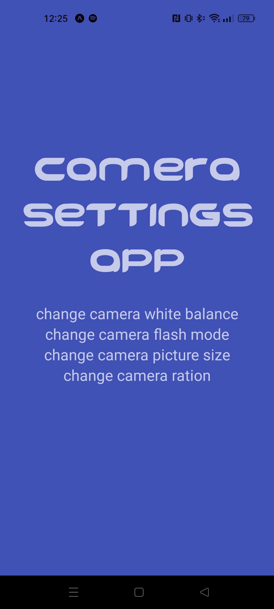
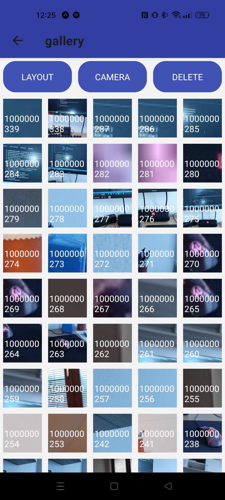
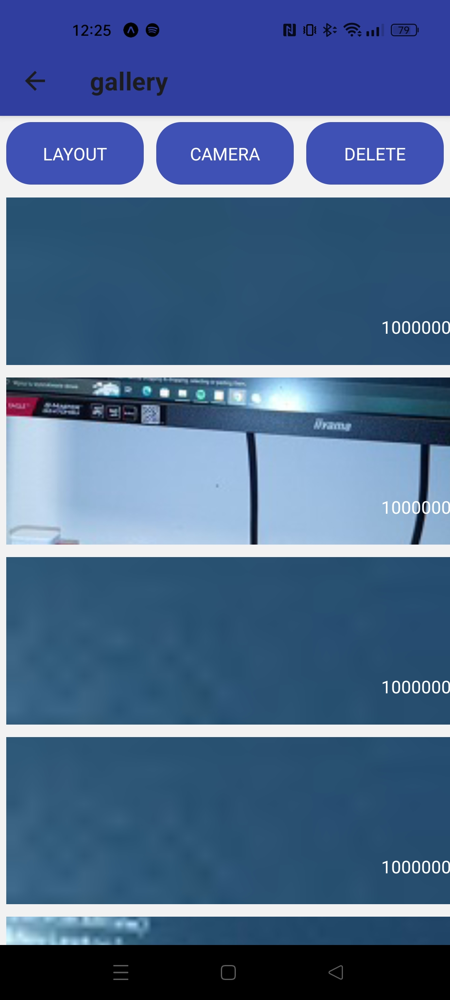
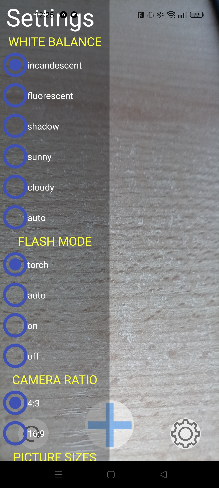
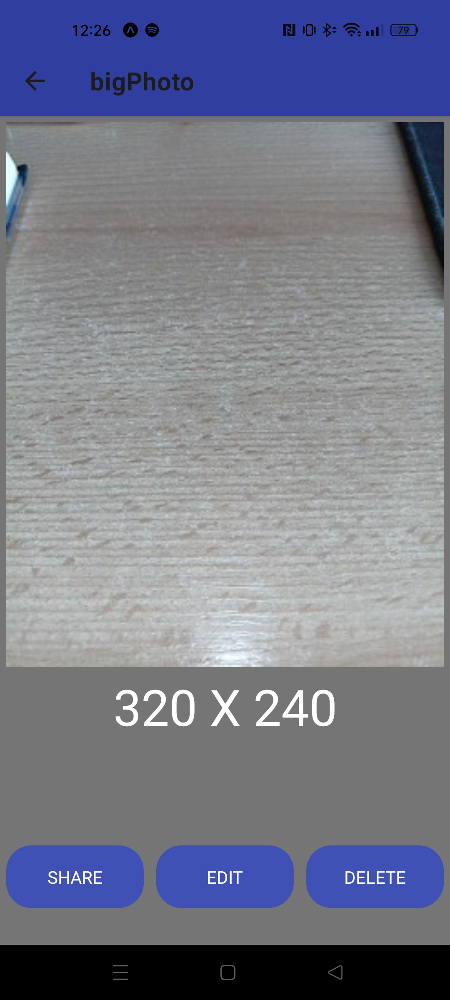
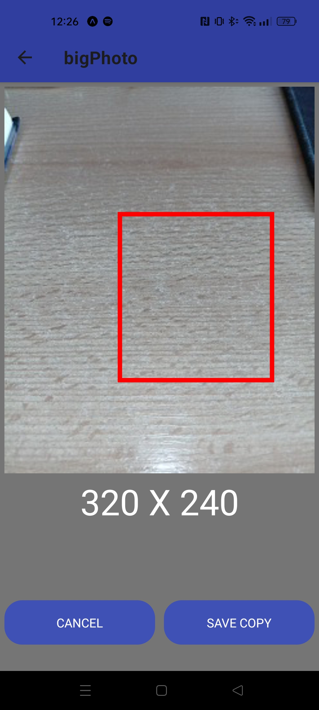

<h1>react_native_camera</h1>

Application made in react native and using expo

<h2>What can we do in application?</h2>
<ol>
  <li>Take photo with some decorations options and save in device memory (DCIM folder)</li>
  <li>Delete saved photos (Only works with photos taken by this app)</li>
  <li>Change view layout</li>
  <li>Open photo in single view (check width and height of photo) </li>
  <li>Photo cropper</li>
  <li>Share taken photo</li>
</ol>

<h2>How to start application?</h2>

Warning! Phone and computer must be in the same local network

Sometimes you need to disable firewall because it can block connection

<ol>
  <li>Make sure that you have installed git command line</li>
  <li>Create empty folder</li>
  <li>Open new folder in cmd</li>
    <li>Write commands:
    <ol type="a" >
      <li><code>git init</code></li>
      <li><code>git pull https://github.com/szariii/react_native_camera.git</code></li>
      <li><code>npm install</code></li>
      <li><code>npm start</code></li>
    </ol>
  </li>
    <li>Install expo app on phone</li>
  <li>Scan QRCode which should show in cmd</li>
</ol>

<h2>Screenshots</h2>

